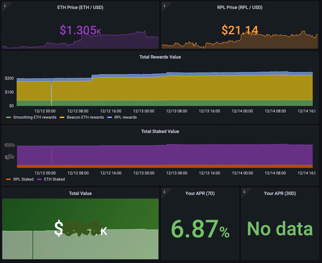

## RocketPool Node Operator overrides to graph total stake dollar value
Graph the total dollar value of both rewards and stake over time.

---
Dashboard:



1. Import `grafana-dashboard.json` into Grafana.

2. Apply changes:

```shell
cat <<EOF > ~/.rocketpool/override/json_exporter.yml
metrics:
  - name: cryptocurrency
    type: object
    help: General statistics of the top cryptocurrencies
    path: '{.coin}'
    labels:
      symbol: '{.symbol}'
    values:
      price: '{.price}'
EOF
```

```shell
cat <<EOF > ~/.rocketpool/override/exporter.yml
# Enter your own customizations for the node exporter container here. These changes will persist after upgrades, so you only need to do them once.
# 
# See https://docs.docker.com/compose/extends/#adding-and-overriding-configuration
# for more information on overriding specific parameters of docker-compose files.

version: "3.7"
services:
  node-exporter:
    x-rp-comment: Add your customizations below this line
  json_exporter:
    image: quay.io/prometheuscommunity/json-exporter:v0.4.0
    container_name: json_exporter
    restart: unless-stopped
    volumes:
      - ~/.rocketpool/override/json_exporter.yml:/config.yml:ro
    networks:
      - net
EOF
```

```shell
cat <<EOF >> ~/.rocketpool/prometheus.tmpl

  - job_name: json_exporter
    scrape_interval: 1m
    scrape_timeout: 15s
    honor_labels: true
    metrics_path: /probe
    static_configs:
      - targets:
          - https://api.coinstats.app/public/v1/coins/ethereum?currency=USD
          - https://api.coinstats.app/public/v1/coins/rocket-pool?currency=USD
    relabel_configs:
      - source_labels: [__address__]
        target_label: __param_target
      - source_labels: [__address__]
        regex: ^http.+currency=([A-Z]{3})
        action: replace
        target_label: currency
        replacement: ${1}
      - source_labels: [__param_target]
        target_label: instance
      - target_label: __address__
        replacement: json_exporter:7979
EOF
```

3. Run `rocketpool service start`


<!-- 
cat <<EOF > ~/.rocketpool/override/prometheus.yml
# Enter your own customizations for the Prometheus container here. These changes will persist after upgrades, so you only need to do them once.
# 
# See https://docs.docker.com/compose/extends/#adding-and-overriding-configuration
# for more information on overriding specific parameters of docker-compose files.

version: "3.7"
services:
  prometheus:
    x-rp-comment: Add your customizations below this line
    command:
    - --storage.tsdb.retention.time=60d
    - --web.listen-address=:9091
    - --config.file=/etc/prometheus/prometheus.yml
-->